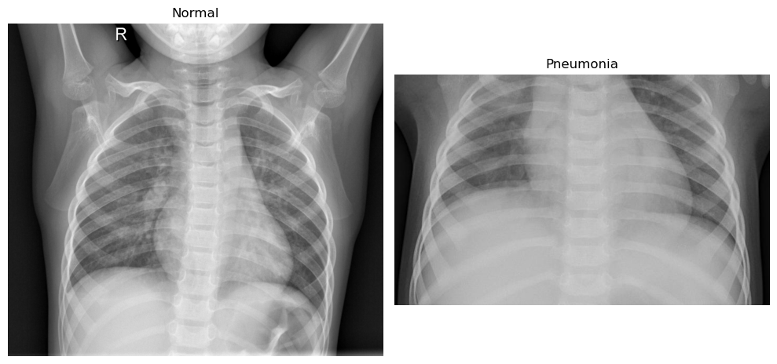
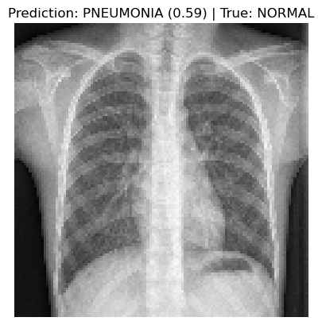

# Pneumonia Detection with Deep Learning  
A convolutional neural network (CNN) built to classify chest X-rays as either Pneumonia or Normal. This project showcases the use of deep learning and medical imaging for binary classification using supervised learning.

---

## Project Overview

- **Goal:** Detect pneumonia in chest X-rays using a deep convolutional neural network.
- **Approach:** Trained a custom CNN from scratch using binary cross-entropy loss and sigmoid activation for classification.
- **Data:** [Chest X-ray Pneumonia Dataset](https://www.kaggle.com/paultimothymooney/chest-xray-pneumonia) — includes 5,000+ labeled chest radiographs across training, validation, and test sets.

---

## Technologies Used

- `Python` • `TensorFlow/Keras` • `scikit-learn` • `NumPy` • `Matplotlib` • `PIL`

---

## Results

- **Test Accuracy:** 86.2%  
- **ROC-AUC Score:** 0.9265  
- **Training Time:** ~24.3 seconds  
- **Observations:** Strong recall on pneumonia cases, but some false positives on normal images. High sensitivity may be beneficial in clinical triage settings.

See [`confusion_matrix.png`](./assets/confusion_matrix.png) and [`roc_curve.png`](./assets/roc_curve.png) for full evaluation.

---

## Visual Data Comparison

  
Side-by-side visualization of a normal lung (left) and a pneumonia-affected lung (right). Pneumonia appears as cloudy or opaque regions due to fluid and inflammation.

---

## Sample Prediction

| Predicted: Pneumonia (0.59) — Actual: Normal |  
|---------------------------------------------|  
|  |  
Example of a false positive: model predicts pneumonia with moderate confidence despite normal ground truth.

---

## Model Architecture

The model is a sequential convolutional neural network (CNN) with four convolutional blocks followed by dense layers for binary classification:

```python
Conv2D(32, (3, 3), activation='relu')  
→ MaxPooling2D  
→ Conv2D(64, (3, 3), activation='relu')  
→ MaxPooling2D  
→ Conv2D(128, (3, 3), activation='relu')  
→ MaxPooling2D  
→ Conv2D(256, (3, 3), activation='relu')  
→ MaxPooling2D  
→ Flatten  
→ Dense(256, activation='relu')  
→ Dense(1, activation='sigmoid')
